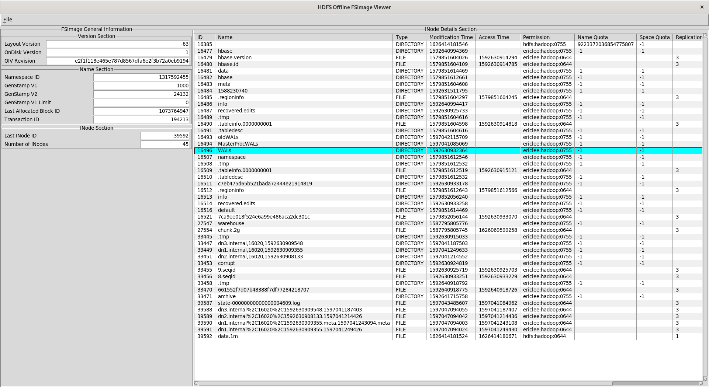

# HDFS Offline FSImage Viewer

## Introduction

HDFS Offline FSImage Viewer is a GUI program to view Hadoop HDFS offline FSImage XML file. The program is written by Tcl language.

## Design Scope

The goal is to create a local use and cross-platform GUI program to view / edit / search items for the FSImage XML file.

## Current Development Status

This project is in **Alpha** phase. I work on this project in my spare time and features can be changed anytime. For more details please check the **CHANGELOG** file.

It can only support loading XML file now.

## Requirements

[Tcl](https://core.tcl-lang.org/tcl)

[Tk](https://core.tcl-lang.org/tk)

[tablelist](https://www.nemethi.de/tablelist/)

[tdom](http://www.tdom.org/)

The current code is tested and passed in the following environment:

* Operating System: Fedora 34 - Linux
* Tcl: tcl-8.6.10-5
* TclLib: tcllib-1.19-6
* Tk: tk-8.6.10-6
* TkLib: tklib-0.5-23
* tdom-0.8.2-30

## Known Performance Issue

1. The table list widget uses the **[tablelist](https://www.nemethi.de/tablelist/)** which is a pure Tcl implementation. So it would be extremely slow for scrolling and big memory usage when showing huge amount of columns.

## Screenshots

### Load a FSImage XML File

## TODO

1. Make each labelframe area size-tunable.
2. Add progress status update in the UI when triggering events.
3. Add feature to load HDFS FSImage file directly. This needs local Java + Hadoop installation.
4. Add feature to search particular entry in the **INode Details Section**.
5. Add block information for each inode if the object type is FILE.
6. Add feature to export inode information as a TSV file.
7. Add edit feature(TBD) for FSImage XML file.

## Reference

[Offline Image Viewer Guide](https://hadoop.apache.org/docs/current/hadoop-project-dist/hadoop-hdfs/HdfsImageViewer.html)
